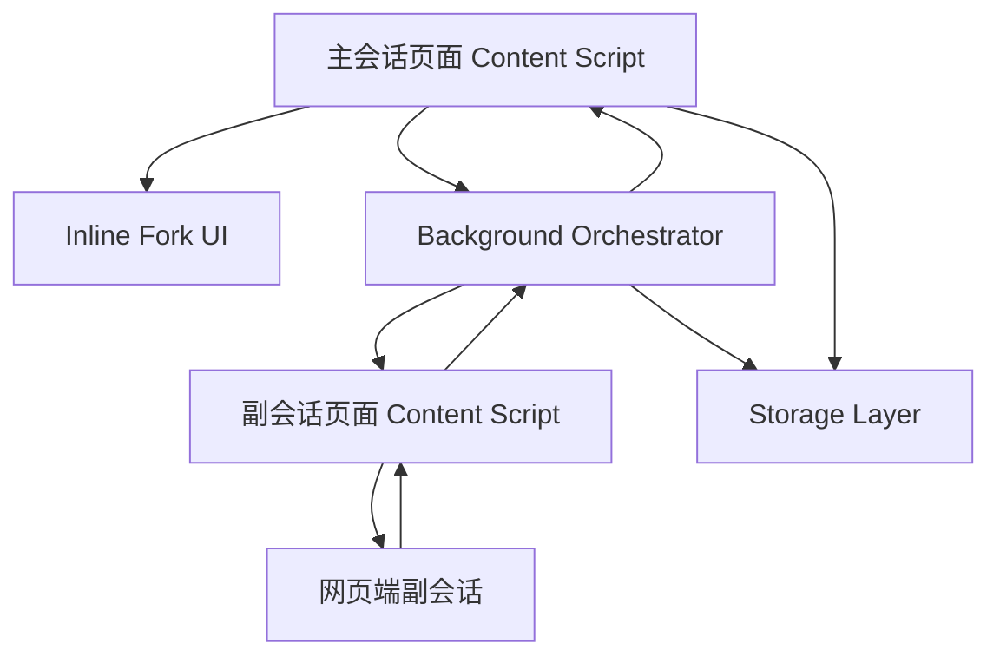
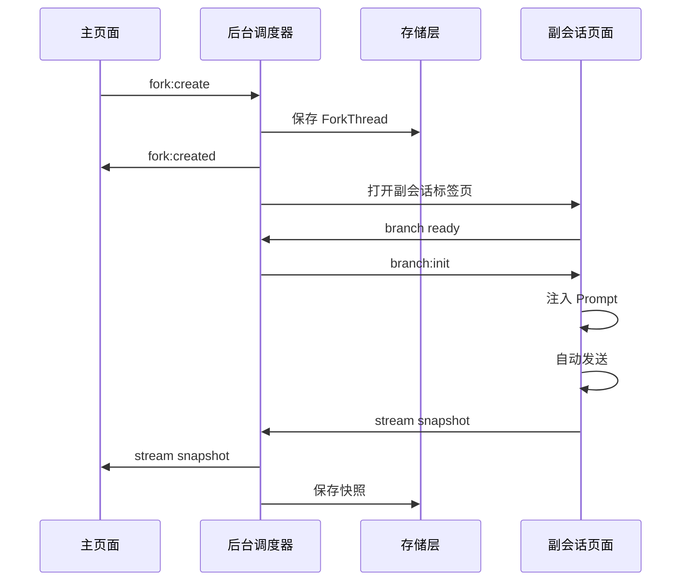

### **一、总目标定义**

你要做的是一个浏览器插件，用户在 AI 网页端的某次回答中选中一段文字后，可以点击“追问这段”，插件自动创建一个独立副会话，把带上下文的分支 Prompt 发送到副会话网页端，并把副会话正在生成的回答以流式镜像方式显示回主页面的原回答附近。

核心目标只有四个：

1. 主会话不被污染，不向主会话输入框写入任何分支问题。
2. 分支回答走网页端副会话，不走 API。
3. 主页面 Inline Fork 实时显示副会话生成内容。
4. 后续每新增一个 AI 网页端，只新增适配器，不改核心系统。

你可以把整个项目定义为：

> 基于网页端副会话的 AI Inline Fork 浏览器插件。

---

### **二、总架构施工图**

整体架构建议固定为五层，不要随意改成临时脚本堆叠。



每层职责要严格分开。

主会话脚本只负责选区、锚点、分支容器和渲染；副会话脚本只负责网页端自动化，包括打开页面、注入 Prompt、发送、监听流式回答；后台调度器只负责状态机、标签页管理、消息路由、任务队列和错误恢复；存储层负责保存分支线程、锚点、副会话 URL、快照内容和运行状态；UI 层负责 Shadow DOM 内的 Inline Fork 组件。

---

### **三、推荐项目目录结构**

你可以先按这个结构建项目，不要一开始写成几个零散文件。

```text
ai-inline-fork-extension/
  package.json
  tsconfig.json
  vite.config.ts

  src/
    manifest/
      manifest.chromium.json
      manifest.firefox.json

    background/
      index.ts
      orchestrator.ts
      route-table.ts
      task-queue.ts
      tab-manager.ts

    content-main/
      index.ts
      selection-listener.ts
      inline-fork-mounter.ts
      main-page-controller.ts

    content-branch/
      index.ts
      branch-page-controller.ts
      stream-observer.ts

    core/
      fork-thread.ts
      fork-run.ts
      state-machine.ts
      prompt-builder.ts
      message-types.ts
      errors.ts

    adapters/
      main/
        base-main-adapter.ts
        generic-main-adapter.ts
        phase1-main-adapter.ts

      branch/
        base-branch-adapter.ts
        generic-branch-adapter.ts
        phase1-branch-adapter.ts

    ui/
      inline-fork/
        InlineFork.ts
        styles.ts
        renderer.ts
        markdown.ts

      floating-button/
        FloatingForkButton.ts
        styles.ts

    storage/
      storage.ts
      fork-thread-store.ts
      settings-store.ts

    browser/
      ext.ts
      permissions.ts
      runtime.ts

    utils/
      dom.ts
      text.ts
      hash.ts
      debounce.ts
      logger.ts

  scripts/
    build-chromium.ts
    build-firefox.ts

  dist/
    chromium/
    firefox/
```

这里的 `phase1-main-adapter.ts` 和 `phase1-branch-adapter.ts` 是阶段一目标站点的专用适配器。阶段二增加其他站点时，只继续添加新的 `xxx-main-adapter.ts` 和 `xxx-branch-adapter.ts`。

---

### **四、不可妥协的核心技术原则**
#### **1. 主页面绝不发送分支问题**

主页面只允许做：

```text
读取选区
读取当前回答文本
挂载 Inline Fork
接收流式镜像内容
渲染分支结果
```

主页面禁止做：

```text
向主输入框写入内容
点击主页面发送按钮
改变主对话滚动状态
把分支内容插入主会话历史
```

#### **2. 副会话是唯一真实生成源**

每个分支线程都必须绑定一个副会话。Inline Fork 只是镜像视图，不是真实会话源。

#### **3. 流式同步采用“完整快照”而不是 DOM 增量**

不要直接从副会话 DOM 中提取新增 token。正确方式是持续读取最后一条 AI 回答的完整文本快照，然后覆盖更新主页面的分支显示区域。

#### **4. 适配器必须和核心逻辑解耦**

核心逻辑不能出现大量站点选择器。所有站点 DOM 选择器、输入框定位、发送按钮定位、回答提取逻辑都必须放进对应适配器。

#### **5. 跨浏览器能力统一封装**

业务代码里不要直接散落使用 `chrome.xxx` 或 `browser.xxx`。必须通过 `src/browser/ext.ts` 统一封装。

---

### **五、核心数据结构**

要求先实现这些类型，再写业务流程。

```ts
export type ForkRunStatus =
  | "fork_created"
  | "opening_branch_tab"
  | "branch_page_loading"
  | "branch_page_ready"
  | "prompt_injecting"
  | "prompt_injected"
  | "submitting"
  | "waiting_generation_start"
  | "streaming"
  | "completed"
  | "mirrored_final"
  | "open_failed"
  | "page_timeout"
  | "prompt_inject_failed"
  | "submit_failed"
  | "generation_timeout"
  | "stream_interrupted"
  | "recovering"
  | "manual_recovery";

export interface ForkThread {
  id: string;

  source: {
    siteId: string;
    mainTabId?: number;
    mainConversationUrl: string;
    mainConversationId?: string;
    sourceMessageId: string;
    sourceMessageTextHash: string;
    selectedText: string;
    selectedRangeHint: {
      paragraphIndex?: number;
      startText?: string;
      endText?: string;
      selectionHash?: string;
    };
  };

  branch: {
    providerSiteId: string;
    branchTabId?: number;
    branchWindowId?: number;
    branchConversationUrl?: string;
    branchConversationId?: string;
    mode: "auto_stream_mirror";
    visibility: "background_tab" | "active_tab" | "popup_window";
  };

  prompt: {
    mainUserQuestion?: string;
    assistantMessage: string;
    selectedText: string;
    branchQuestion: string;
    finalPrompt: string;
  };

  messages: ForkMessage[];

  stream: {
    status: ForkRunStatus;
    currentText: string;
    lastSeq: number;
    startedAt?: number;
    updatedAt?: number;
    completedAt?: number;
    error?: string;
  };

  ui: {
    collapsed: boolean;
    anchorStatus: "exact" | "message_bottom" | "lost";
    inlineContainerId: string;
  };

  createdAt: number;
  updatedAt: number;
}

export interface ForkMessage {
  id: string;
  role: "user" | "assistant";
  content: string;
  source: "inline_user" | "branch_mirror";
  runId?: string;
  seq?: number;
  createdAt: number;
  updatedAt?: number;
  status?: "streaming" | "completed" | "failed";
}
```

---

### **六、核心消息协议**

插件不同脚本之间必须通过明确消息协议通信，不要靠临时字符串。

```ts
export type ExtensionMessage =
  | {
      type: "fork:create";
      payload: CreateForkPayload;
    }
  | {
      type: "fork:created";
      payload: {
        forkThreadId: string;
        inlineContainerId: string;
      };
    }
  | {
      type: "fork:status";
      payload: {
        forkThreadId: string;
        status: ForkRunStatus;
        message?: string;
      };
    }
  | {
      type: "fork:stream_snapshot";
      payload: {
        forkThreadId: string;
        text: string;
        seq: number;
        status: "streaming" | "completed";
        updatedAt: number;
      };
    }
  | {
      type: "fork:error";
      payload: {
        forkThreadId: string;
        status: ForkRunStatus;
        message: string;
      };
    }
  | {
      type: "branch:init";
      payload: {
        forkThreadId: string;
        finalPrompt: string;
      };
    };
```

后台调度器维护一个路由表：

```ts
export interface ForkRoute {
  forkThreadId: string;
  mainTabId: number;
  branchTabId: number;
  inlineContainerId: string;
  createdAt: number;
}
```

副会话每次发来 `fork:stream_snapshot`，后台根据路由表转发给主页面。

---

### **七、核心适配器接口**

阶段一和阶段二都必须围绕这两个接口施工。

#### **主页面适配器**

```ts
export interface MainPageAdapter {
  siteId: string;

  detect(): boolean;

  findAssistantMessages(): HTMLElement[];

  getMessageId(element: HTMLElement): string;

  getMessageText(element: HTMLElement): string;

  getConversationId?(): string;

  getConversationUrl(): string;

  resolveSelectionAnchor(selection: Selection): SelectionAnchor | null;

  mountInlineFork(anchor: SelectionAnchor, threadId: string): HTMLElement;
}
```

#### **副会话适配器**

```ts
export interface BranchPageAdapter {
  siteId: string;

  detect(): boolean;

  waitUntilReady(timeoutMs: number): Promise<void>;

  injectPrompt(prompt: string): Promise<void>;

  submitPrompt(): Promise<void>;

  waitGenerationStart(timeoutMs: number): Promise<void>;

  getLastAssistantMessageElement(): HTMLElement | null;

  extractAssistantText(element: HTMLElement): string;

  isGenerating(): boolean;

  observeStreamingAnswer(
    onSnapshot: (snapshot: {
      text: string;
      status: "streaming" | "completed";
    }) => void
  ): () => void;

  getConversationUrl(): string;

  getConversationId?(): string;
}
```

阶段二新增站点时，只实现这两个接口，不允许修改 `orchestrator.ts` 的核心流程。

---

## **阶段一：适配首个网页端 + Chrome / Edge / Firefox**

阶段一的目标不是“做得漂亮”，而是把端到端链路跑通。

### **阶段一目标**

阶段一必须完成：

| 模块 | 目标 | 验收标准 |
|---|---|---|
| 主页面选区 | 能识别 AI 回答并选中片段 | 选中回答内文字后出现“追问这段” |
| Inline Fork | 能在原回答附近挂载分支容器 | 不破坏原页面布局 |
| 副会话创建 | 能自动打开新副会话标签页 | 分支线程绑定副会话 URL |
| Prompt 注入 | 能自动填入构造好的分支 Prompt | 输入框内容与 Prompt 一致 |
| 自动发送 | 能触发副会话发送 | 副会话开始生成 |
| 流式镜像 | 能把副会话回答同步回主页面 | 主页面分支容器实时变化 |
| 本地保存 | 刷新后能恢复分支 | 分支不丢失 |
| 浏览器兼容 | 能打包三个浏览器版本 | 三个目标浏览器可安装运行 |

---

### **阶段一施工顺序**

#### **第 1 步：搭建扩展工程骨架**

要求开发助手先完成：

```text
TypeScript 工程
Manifest V3 基础配置
Chromium 构建
Firefox 构建
background script
content-main script
content-branch script
storage 封装
runtime message 封装
```

验收方式：

```text
插件能在浏览器加载
主页面能打印 content-main ready
副会话页面能打印 content-branch ready
background 能接收 content script 消息
```

---

#### **第 2 步：实现跨浏览器封装**

实现 `src/browser/ext.ts`：

```ts
export const ext = globalThis.browser ?? globalThis.chrome;
```

再封装这些能力：

```text
runtime.sendMessage
runtime.onMessage
tabs.create
tabs.sendMessage
tabs.update
tabs.get
storage.local.get
storage.local.set
scripting.executeScript
```

验收标准：

```text
业务代码不直接调用 chrome.xxx
业务代码不直接调用 browser.xxx
所有浏览器 API 都从 browser 层引入
```

---

#### **第 3 步：实现主页面选区和浮动按钮**

用户选中 AI 回答内容后，显示一个浮动按钮。

交互流程：

```text
用户选中文本
  ↓
判断选区是否位于 AI 回答块内
  ↓
计算选区位置
  ↓
显示“追问这段”
  ↓
点击后展示一个小输入框
  ↓
用户输入分支问题
  ↓
创建 Inline Fork 容器
```

验收标准：

```text
只在 AI 回答中选中时触发
选中用户自己提问时不触发
选中空白处不触发
浮动按钮不会遮挡正文
```

---

#### **第 4 步：实现 Inline Fork 容器**

Inline Fork 必须用 Shadow DOM 隔离样式，避免被网页 CSS 影响。

最小 UI：

```text
分支标题
用户追问
状态行
流式回答区域
操作区：打开副会话 / 重试 / 折叠
```

状态行示例：

```text
正在创建分支会话……
正在发送……
正在同步回答……
已完成
同步失败，点击重试
```

验收标准：

```text
容器出现在被选中片段所在回答附近
页面刷新后能重新挂载
样式不污染原网页
原网页样式不污染插件 UI
```

---

#### **第 5 步：实现 Prompt Builder**

阶段一先固定一个稳定 Prompt 模板。

```text
你正在回答一个从主对话中分叉出来的局部追问。

【主会话中的最近问题】
{mainUserQuestion}

【主会话中的 AI 回答】
{assistantMessage}

【用户选中的片段】
{selectedText}

【用户的分支追问】
{branchQuestion}

请只围绕“用户选中的片段”和“用户的分支追问”回答。
不要继续主会话，也不要假设你能看到原网页。
如果需要引用上下文，只能依据上面提供的信息。

【分支ID】
{forkThreadId}
```

验收标准：

```text
Prompt 自包含
副会话单独打开也能理解问题
Prompt 中包含分支 ID
不会要求副会话操作原网页
```

---

#### **第 6 步：实现后台调度器 Orchestrator**

后台调度器负责完整自动流程。



验收标准：

```text
每个 ForkThread 有唯一 ID
每个 ForkThread 能绑定 mainTabId 和 branchTabId
副会话快照能被正确路由回对应 Inline Fork
```

---

#### **第 7 步：实现副会话自动执行**

副会话脚本要执行：

```text
等待页面就绪
找到输入框
注入 Prompt
检查注入结果
点击发送
等待回答出现
监听回答变化
发送快照回后台
```

副会话自动执行要有超时：

```text
页面就绪超时：20 秒
Prompt 注入超时：10 秒
发送等待超时：10 秒
生成开始超时：30 秒
生成稳定判断：2.5 秒无变化且不在生成中
```

验收标准：

```text
副会话能自动发送
发送失败时进入 manual_recovery
不会重复发送同一个 Prompt
生成过程中能持续同步快照
```

---

#### **第 8 步：实现流式镜像同步**

副会话不要发送增量 token，而是发送完整快照。

副会话逻辑：

```ts
let lastText = "";
let seq = 0;

function emitIfChanged(text: string, status: "streaming" | "completed") {
  if (!text || text === lastText) return;

  lastText = text;
  seq += 1;

  sendMessage({
    type: "fork:stream_snapshot",
    payload: {
      forkThreadId,
      text,
      seq,
      status,
      updatedAt: Date.now()
    }
  });
}
```

主页面逻辑：

```text
收到快照
  ↓
检查 seq 是否比当前更新
  ↓
更新 Inline Fork 的回答区域
  ↓
更新状态
  ↓
完成后做最终 Markdown 渲染
```

验收标准：

```text
不会重复文字
不会丢字
不会把按钮文字同步进回答
生成完成后状态变为已完成
```

---

#### **第 9 步：实现本地保存和恢复**

必须保存：

```text
ForkThread
ForkRoute
当前流式快照
主页面 URL
副会话 URL
锚点信息
分支状态
```

刷新主页面后：

```text
扫描当前页面 AI 回答
用 messageId / textHash / selectedText 恢复锚点
重新挂载 Inline Fork
显示已保存的分支内容
```

锚点恢复优先级：

| 优先级 | 方法 |
|---|---|
| 1 | conversationId + sourceMessageId |
| 2 | sourceMessageTextHash |
| 3 | selectedText 在回答中搜索 |
| 4 | paragraphIndex + startText / endText |
| 5 | 挂到整条回答底部 |

验收标准：

```text
刷新主页面后分支还在
副会话标签关闭后仍能打开副会话 URL
锚点找不到时不丢数据
```

---

#### **第 10 步：完成三个浏览器的构建**

阶段一浏览器兼容策略：

```text
Chrome 和 Edge 使用同一份 Chromium 构建
Firefox 单独 manifest
核心代码共享
权限最小化
```

Manifest 差异单独维护：

```text
manifest.chromium.json
manifest.firefox.json
```

验收标准：

```text
Chrome 可安装并完成完整链路
Edge 可安装并完成完整链路
Firefox 可安装并完成完整链路
```

---

## **阶段二：扩展适配其他主流网页端**

阶段二的原则是：不改核心，只加适配器。

### **阶段二目标**

阶段二要完成：

```text
每个新站点都有 MainPageAdapter
每个新站点都有 BranchPageAdapter
每个新站点都有基础自动化测试清单
每个新站点都能跑通：选区 → 副会话 → 自动发送 → 流式镜像
```

不要让开发助手为了某个站点改核心流程。如果必须改核心，说明阶段一抽象不够，要先回到接口层修正，而不是在业务代码里加特例。

---

### **阶段二每个站点的施工流程**

每适配一个新站点，都按同一套流程。

#### **步骤 1：主页面 DOM 勘察**

记录这些信息：

```text
AI 回答容器选择器
用户消息容器选择器
消息列表容器
回答操作区
复制按钮区域
滚动容器
会话 ID 来源
回答文本提取方式
```

产出：

```text
xxx-main-adapter.ts
```

验收标准：

```text
能正确识别所有 AI 回答
不会把用户消息误判为 AI 回答
能拿到当前回答全文
能根据选区定位到对应回答
```

---

#### **步骤 2：副会话 DOM 勘察**

记录这些信息：

```text
新会话 URL 或入口
输入框类型
发送按钮选择器
发送按钮可用状态判断
生成中状态判断
最后一条 AI 回答容器
回答完成判断信号
```

产出：

```text
xxx-branch-adapter.ts
```

验收标准：

```text
能自动打开新会话
能注入 Prompt
能自动发送
能监听最后一条回答
能判断生成完成
```

---

#### **步骤 3：站点能力分级**

每个站点适配完成后，要标记能力等级。

| 等级 | 能力 | 说明 |
|---|---|---|
| A | 全自动 + 流式镜像 | 理想状态 |
| B | 自动打开 + 自动注入 + 手动发送 + 流式同步 | 发送受限 |
| C | 自动打开 + 手动粘贴 + 手动同步 | 页面自动化困难 |
| D | 仅生成 Prompt | 兜底模式 |

阶段二目标是尽量达到 A，但允许部分站点先达到 B。不要因为某个站点卡住而阻塞整体。

---

### **阶段二适配器注册机制**

适配器不要手动到处 import 调用，建议统一注册。

```ts
const mainAdapters: MainPageAdapter[] = [
  phase1MainAdapter,
  site2MainAdapter,
  site3MainAdapter,
  site4MainAdapter
];

export function getMainAdapter(): MainPageAdapter | null {
  return mainAdapters.find((adapter) => adapter.detect()) ?? null;
}
```

副会话同理：

```ts
const branchAdapters: BranchPageAdapter[] = [
  phase1BranchAdapter,
  site2BranchAdapter,
  site3BranchAdapter,
  site4BranchAdapter
];

export function getBranchAdapter(): BranchPageAdapter | null {
  return branchAdapters.find((adapter) => adapter.detect()) ?? null;
}
```

验收标准：

```text
新增站点只需要新增 adapter 文件并注册
核心 orchestrator 不感知具体站点
```

---

### **阶段二测试矩阵**

每个新站点都要测这些场景：

| 场景 | 验收标准 |
|---|---|
| 普通文本回答 | 能创建分支并同步 |
| Markdown 回答 | 渲染不乱 |
| 代码块回答 | 代码不丢失 |
| 长回答 | 滚动和同步不卡顿 |
| 多轮继续追问 | 复用同一个副会话 |
| 主页面刷新 | 分支能恢复 |
| 副会话关闭 | 能通过 URL 恢复 |
| 未登录状态 | 能进入可理解的错误提示 |

---

## **阶段三：优化插件表现**

阶段三才做体验、性能、恢复、可发布质量。不要在阶段一就过度打磨。

### **阶段三目标**

阶段三优化方向包括：

```text
交互体验
视觉表现
性能
错误恢复
权限体验
数据管理
稳定性
商店发布准备
```

---

### **1. 交互优化**

Inline Fork 的成熟版应该支持：

```text
折叠 / 展开
继续追问
打开副会话
复制回答
重新同步
停止镜像
删除分支
重命名分支
多个分支标签切换
```

同一个回答片段下可以显示：

```text
分支 1：解释概念
分支 2：给出反例
分支 3：检查漏洞
```

但默认不要全部展开，避免把页面再次变复杂。

---

### **2. 流式渲染优化**

优化策略：

```text
生成中使用轻量文本渲染
每 500 到 1000 毫秒节流 Markdown 渲染
完成后做最终 Markdown 渲染
代码高亮只在完成后执行
长文本超过阈值时局部渲染
```

目标：

```text
主页面不卡顿
长回答同步时不闪烁
代码块不重复渲染
Markdown 最终格式正确
```

---

### **3. 错误恢复优化**

成熟版要有明确恢复路径。

| 错误 | 用户看到的操作 |
|---|---|
| 副会话未登录 | 打开副会话完成登录 |
| 注入失败 | 复制 Prompt 手动粘贴 |
| 自动发送失败 | 已填入，请手动点击发送 |
| 同步中断 | 重新同步 |
| 主页面锚点丢失 | 挂到回答底部 |
| 副会话关闭 | 重新打开副会话 |
| 生成失败 | 保留已同步内容并允许重试 |

错误文案要具体，但不要吓人。例如：

```text
同步中断，已保留当前内容。你可以重新同步，或打开副会话查看完整回答。
```

---

### **4. 分支工作区**

阶段三可以增加一个插件侧边栏或弹窗，集中管理分支。

工作区内容：

```text
当前页面所有分支
所有正在运行的副会话
失败任务
最近创建的分支
按站点筛选
按主会话筛选
搜索分支内容
```

这会把插件从一个“小按钮工具”升级成“分支会话管理器”。

---

### **5. 并发队列优化**

阶段三必须加入并发控制，防止同时打开太多副会话。

推荐默认值：

```text
单站点最多同时运行 1 个分支任务
全局最多同时运行 2 个分支任务
同一主页面最多保留 3 个活跃流式分支
```

超过限制时显示：

```text
排队中，前面还有 1 个分支任务。
```

---

### **6. 权限与隐私优化**

成熟版必须有首次使用说明：

```text
此插件会读取你选中的 AI 回答片段，并把它与当前回答上下文发送到一个新的网页端副会话中。主会话不会被修改。
```

设置页提供：

```text
启用 / 禁用站点
自动发送开关
后台打开副会话开关
保存历史开关
清空所有本地数据
导出分支记录
上下文范围设置
```

默认设置建议：

```text
自动发送：开启，但首次使用前确认
上下文范围：当前回答 + 选中片段
本地保存：开启
云同步：关闭
```

---

### **7. 发布前稳定性优化**

发布前要完成：

```text
日志系统
错误码系统
版本迁移系统
存储 schema migration
适配器健康检查
站点支持状态标识
性能监控开关
```

日志不要记录完整用户内容，默认只记录：

```text
threadId
siteId
status
errorCode
timestamp
adapterName
```

---

## **整体里程碑安排**

可以按 8 个里程碑推进。

| 里程碑 | 内容 | 结果 |
|---|---|---|
| M1 | 工程骨架 + 跨浏览器封装 | 插件可安装 |
| M2 | 主页面选区 + Inline Fork | 能创建本地分支 UI |
| M3 | 后台调度器 + 存储 | 能保存 ForkThread |
| M4 | 阶段一副会话自动化 | 能自动打开、注入、发送 |
| M5 | 流式镜像同步 | 能实时回显 |
| M6 | 三浏览器打包测试 | 阶段一完成 |
| M7 | 阶段二站点适配 | 多站点可用 |
| M8 | 阶段三体验优化 | 可公开测试 |

---

## **你可以直接发给开发助手的任务拆解**

### **任务 1：初始化项目**

```text
请创建一个 TypeScript 浏览器扩展项目，目标支持 Chrome、Edge、Firefox。使用 Manifest V3，建立 background、content-main、content-branch 三类脚本。请先实现统一浏览器 API 封装，不要在业务代码中直接使用 chrome.xxx 或 browser.xxx。
```

验收：

```text
插件能安装
三个脚本能正常启动
background 能接收 content script 消息
```

---

### **任务 2：实现核心类型和状态机**

```text
请实现 ForkThread、ForkMessage、ForkRunStatus、ExtensionMessage、ForkRoute 等核心类型，并实现一个状态机模块。所有状态变化必须通过统一函数 transitionForkStatus 执行，禁止随意直接改 status。
```

验收：

```text
状态变更有日志
非法状态跳转会报错
ForkThread 能保存到 storage
```

---

### **任务 3：实现主页面选区与 Inline Fork**

```text
请实现主页面 content script：识别 AI 回答块，监听用户选区，选中回答内文字时显示“追问这段”按钮。点击后让用户输入分支问题，并在原回答附近挂载 Shadow DOM Inline Fork 容器。
```

验收：

```text
选中 AI 回答时出现按钮
能创建分支容器
容器不破坏原页面样式
```

---

### **任务 4：实现阶段一主页面适配器**

```text
请为阶段一目标网页端实现 MainPageAdapter。它必须能 detect 当前页面、识别 AI 回答、提取回答文本、生成 messageId、解析选区锚点，并把 Inline Fork 挂载到对应回答附近。
```

验收：

```text
能正确识别 AI 回答
能排除用户消息
能提取完整回答文本
能在刷新后恢复锚点
```

---

### **任务 5：实现 Prompt Builder**

```text
请实现 prompt-builder.ts，根据主会话最近问题、当前 AI 回答、用户选中片段、用户分支问题生成自包含分支 Prompt。Prompt 必须包含 forkThreadId，且明确说明这是局部分支追问，不要继续主会话。
```

验收：

```text
生成的 Prompt 可直接在新会话中独立使用
Prompt 包含选中片段和分支问题
```

---

### **任务 6：实现后台 Orchestrator**

```text
请实现 background orchestrator：接收 fork:create，创建 ForkThread，保存到 storage，打开副会话标签页，建立 ForkRoute，并把 branch:init 消息发送给副会话 content script。
```

验收：

```text
主页面创建分支后能打开副会话
ForkThread 保存成功
ForkRoute 建立成功
```

---

### **任务 7：实现阶段一副会话适配器**

```text
请为阶段一目标网页端实现 BranchPageAdapter。它必须能等待页面就绪、找到输入框、注入 Prompt、自动发送、等待回答开始、提取最后一条 AI 回答文本、判断是否仍在生成。
```

验收：

```text
能自动填入 Prompt
能自动发送
能读取最后一条 AI 回答
能判断生成完成
```

---

### **任务 8：实现流式快照同步**

```text
请实现副会话 stream observer。不要做 token delta，请每隔固定时间或在 DOM 变化时提取最后一条 AI 回答的完整文本快照。如果文本变化，就发送 fork:stream_snapshot 到 background，由 background 转发给主页面 Inline Fork。
```

验收：

```text
主页面能实时看到副会话回答
不会重复文字
不会把操作按钮文字混进回答
完成后状态变为 completed
```

---

### **任务 9：实现刷新恢复**

```text
请实现 ForkThread 恢复逻辑。主页面刷新后，根据当前 URL 找到相关 ForkThread，扫描 AI 回答，使用 messageId、textHash、selectedText、paragraphIndex 等策略恢复锚点，并重新挂载 Inline Fork。
```

验收：

```text
刷新页面后分支仍显示
锚点找不到时挂载到回答底部
数据不丢失
```

---

### **任务 10：实现三浏览器构建**

```text
请实现 chromium 和 firefox 两套 manifest 构建输出。Chrome 和 Edge 共享 chromium 构建，Firefox 使用 firefox manifest。确保核心代码共享，只有 manifest 和少量兼容层差异。
```

验收：

```text
Chrome 可安装使用
Edge 可安装使用
Firefox 可安装使用
阶段一完整链路在三个浏览器都可跑通
```

---

## **阶段一最终验收清单**

阶段一完成时，必须能做到：

```text
在目标 AI 网页端打开一条已有主会话
选中某条 AI 回答中的一段文字
点击“追问这段”
输入分支问题
插件自动打开副会话
插件自动注入 Prompt
插件自动发送
副会话开始生成
主页面原回答附近实时显示分支回答
生成完成后状态显示已完成
刷新主页面后分支仍存在
点击“打开副会话”能回到真实副会话
Chrome、Edge、Firefox 都能运行
```

如果这些做不到，不要进入阶段二。

---

## **阶段二最终验收清单**

阶段二完成时，必须能做到：

```text
至少多个主流网页端都具备独立适配器
每个站点支持主页面选区
每个站点支持副会话自动执行
每个站点支持流式镜像或降级同步
核心 orchestrator 未因站点适配被污染
新增站点成本主要集中在 adapter 文件
```

阶段二的判断标准不是“所有站点体验完全一样”，而是“架构允许稳定扩展”。

---

## **阶段三最终验收清单**

阶段三完成时，插件应该具备可公开测试的表现：

```text
Inline Fork UI 稳定美观
多分支不混乱
长回答不卡顿
失败可恢复
权限说明清晰
本地数据可管理
副会话可追溯
站点支持状态明确
三浏览器打包稳定
```

---

### **指挥开发助手时的关键要求**

你可以反复强调这几句话：

```text
不要先做多站点，先跑通阶段一完整链路。
不要把站点选择器写进核心逻辑，必须放进 adapter。
不要用 DOM delta，同步用完整文本快照。
不要污染主会话，主页面只展示 Inline Fork。
不要在业务代码里直接使用 chrome 或 browser API。
不要为了某个站点临时修改 orchestrator。
每完成一个模块都要给出验收方法。
```

这套施工方式的核心是：阶段一打地基，阶段二加适配器，阶段三做体验。如果阶段一的抽象做扎实，后面适配更多网页端时就不会变成维护噩梦。